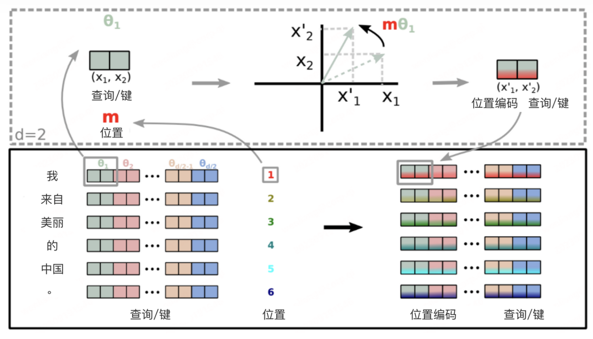
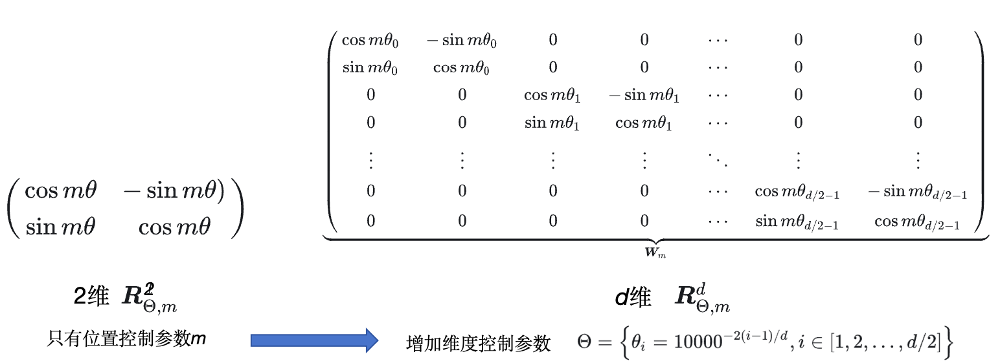
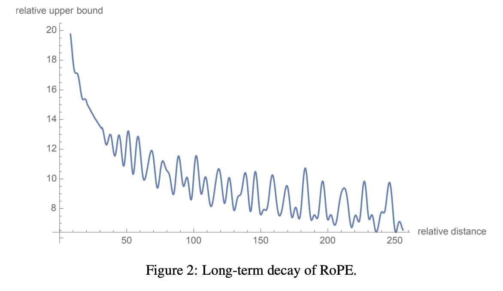

# 介绍
一个快速理解旋转位置编码在自然语言，多模态场景应用的库  
以下先简单介绍ROPE论文原理，后拓展到多模态场景的2D、3D的旋转位置编码

# ROPE详解
目前流行的llm通常在attention和embedding层使用这种相对位置编码，使当前位置的token更加关注临近位置token，在长时序捕捉能力更强。[论文](https://arxiv.org/pdf/2104.09864) [论文解析](https://zhuanlan.zhihu.com/p/647109286)
<div align="center">
  
  <p style="font-size: 10px; color: gray;">rope原理</p>
</div>

#### *原理介绍*  
* 相对位置编码通过在注意力计算`q[m]*k[n]^T`引入`q[m]`相对于`k[n]`的位置信息(m-n)，标记位置信息，使得注意力计算不仅与`q[m]`和`k[n]`本身相关也与他们的处在序列的位置相关，*这里q,k都是行向量*。     。
* 先从二维向量的考量，对于`q[m]和k[n]`，假如存在这样的一个二维旋转矩阵函数`R(posion)`，若R满足`q[m]*R(m) * (k[n] * R(n))^T) = q[m]*R(m-n)*k[n]^T`，此时对于注意力分数的计算结果受到相对位置(m-n)的影响，成功引入了相对位置信息   
* 推广到多维向量，只需要对q，k的向量元素按照二维两两配对，R的控制参数在位置参数基础上引入维度参数，由于注意力点乘后具有加性，刚好也能够性质`q[m]*R(m) * (k[n] * R(n))^T) = q[m]*R(m-n)*k[n]^T`，作者设计这种R函数机制，如图rope原理
<div align="center">
  
  <p style="font-size: 10px; color: gray;">旋转矩阵拓展</p>
</div>


#### *远程衰减性的证明：随着相对距离变大，qk^T的权重普遍应该是下降*  
原始论文通不等式转换，在进行旋转位置编码后计算q*k^T的注意力分数是一个与相对距离有关的分数，其最大值存在远程衰减性。这一性质使得注意力计算中更加关注邻近token
<div align="center">
  
  <p style="font-size: 10px; color: gray;">注意力上限衰减曲线</p>
</div>

#### *外推延展性的证明：当序列长度超出预训练设定，仍能捕捉不超过预训练相对长度的位置关系*   
* 论文中没有提到这种外推的说明，说一下自己的直观理解。远程衰减性可以看出，ROPE使得token更加关注近邻位置，关注度与q,k的相对距离有关，而与绝对的位置无关。   
* 我理解注意力计算的q*k^T只要相对关系不超出预训练的最大相对长度，都是能够在训练效果内的，那么对于每个token，应该有一个前后有效的最大窗口。而对相对距离超出的窗口的，这些q,k注意依赖本身也很弱，因此影响不会太大，加上前后信息的传递性，这种影响会被进一步削弱。   
* 因此，当新增序列，仍然能够被有效处理。

#### *代码解析*   
* 矩阵点乘实现：论文中为了避免稀疏矩阵做内积的低效性，提出了点乘实现寻转位置编码，可以参照```/Rope/rope_chatGLM.py```   
* 虚数内积实现：另一种优化方式是，使用虚数矩阵做内积实现，可以参照```/Rope/rope_llama.py```

# ROPE拓展
相对于文本，图片和视频的位置信息更加复杂。图片的长宽天然表示两个不同维度，处于不同区域的物体相对于其他物体的位置关系是不同的。视频由多帧连续图片构成，在图片基础上增加了一个时间维度。

由此，文本的ROPE是1D的，可以拓展为图片的2D和视频的3D

## 2D ROPE


## 3D ROPE

## 应用
QwenVL2以后使用了这种3D多模态位置编码，特别地，可以兼容图片2D和文本1D的位置编码
